# TabServo

**AI-powered Tableau support that lives inside the dashboard.**

Users describe the problem. The agent reads the workbook, diagnoses the root cause, applies the fix, and republishes. All within minutes. No context-switching. No waiting for IT.

<p align="center">
  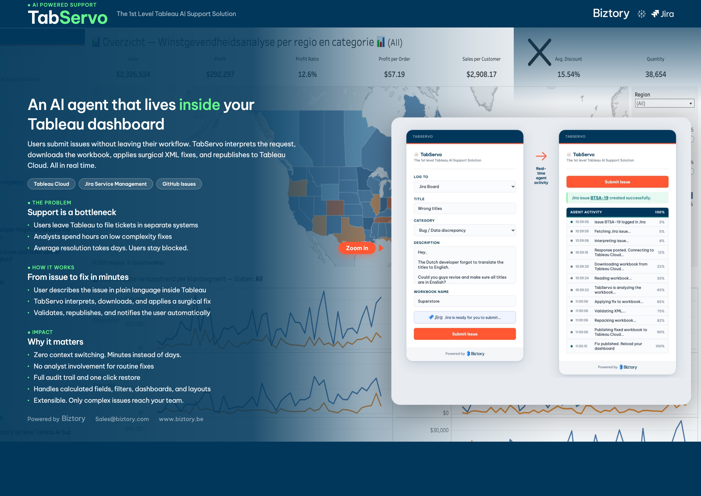
</p>

<p align="center">
  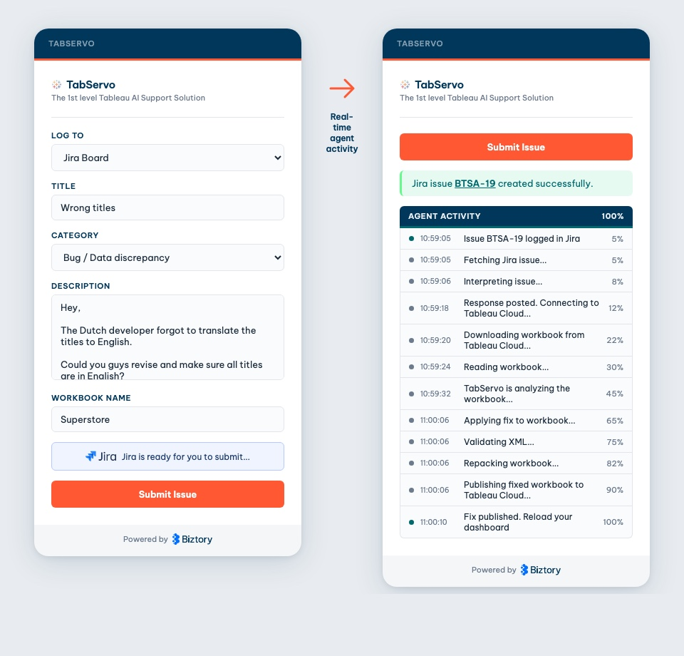
</p>

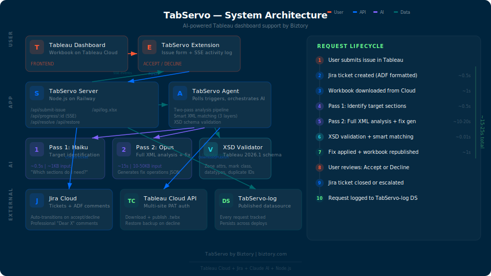

---

## The Problem

Tableau support is a bottleneck.

When a business user spots a broken calculation, a wrong filter, or a mislabeled chart, the typical process looks like this:

1. Leave Tableau
2. Open a separate ticketing tool
3. Describe the problem out of context
4. Wait for an analyst to pick it up
5. Wait for the analyst to understand it, locate the issue, fix it, and republish

For organisations managing dozens of dashboards, this loop burns analyst hours on low-complexity fixes and leaves business users blocked for days on issues an experienced Tableau developer could resolve in minutes.

**Boring and low complexity repetitive Level 1 support should not require a human. Humans are not robots.**

## The Solution

TabServo is a Tableau Extension (.trex) that embeds directly inside any dashboard. Users click a button, describe the issue in plain language, and an AI agent handles everything from there. In real time. While they watch.

The agent:
- Logs a Jira ticket with structured, professional formatting
- Posts an interpretation: "Here is how I understand your problem"
- Downloads the workbook from Tableau Cloud
- Unpacks the TWB XML and identifies the relevant sections
- Diagnoses the root cause using a two-pass AI pipeline
- Generates surgical XML fix operations
- Validates against the official Tableau 2026.1 XSD schema
- Applies the fix using smart three-layer XML matching
- Republishes the workbook to Tableau Cloud
- Streams live progress updates back to the user

If the fix is wrong, the user restores the previous version with one click.

Every request is logged, tracked, and exportable. Issues are automatically closed or escalated in Jira based on the user's decision.

**Zero context-switching. Zero wait time. Zero analyst involvement for Level 1 fixes.**

---

## How It Works

### 1. Submit

The user fills in a form inside the Tableau dashboard: title, description, category, and workbook name. They select the Tableau Cloud site and click Submit.

<p align="center">
  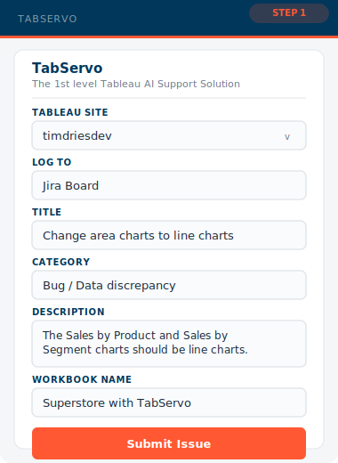
</p>

A Jira ticket is created instantly with rich formatting: a greeting, the issue description, a details table, and a TabServo signature.

<p align="center">
  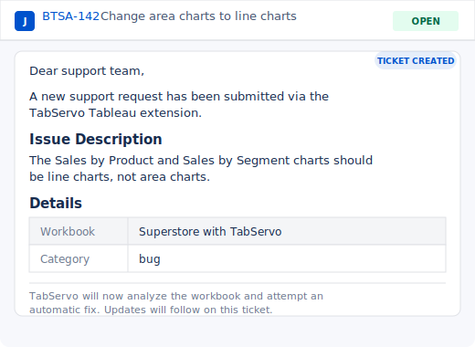
</p>

The agent posts an interpretation comment confirming it understood the problem:

<p align="center">
  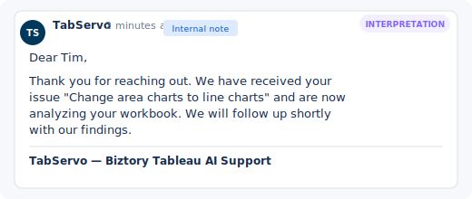
</p>

### 2. Analyse

The agent downloads the workbook and unpacks the XML. A two-pass AI pipeline identifies what needs to change:

| Pass | Model | Purpose | Input | Time |
|------|-------|---------|-------|------|
| 1 | Haiku | Identify which worksheets/dashboards to inspect | Workbook overview (~1KB) | ~0.5s |
| 2 | Opus | Full XML analysis + fix generation | Targeted sections (10-50KB verbatim) | ~10-20s |

Pass 1 keeps cost low and speed high. Pass 2 sees the complete, untruncated XML of exactly the sections it needs.

### 3. Validate and Apply

Generated fixes are validated against the Tableau 2026.1 XSD schema before being applied:

- Zone required attributes (x, y, w, h, id)
- Mark class enum values
- DataType and FieldType validation
- Duplicate zone ID detection

Fixes are located in the workbook XML using a three-layer smart matching fallback:

1. **Exact match** — verbatim string comparison
2. **Whitespace-normalized** — collapses indentation differences
3. **Attribute-based** — finds elements by `id`, `name`, or `column` attributes with proper depth tracking

### 4. Publish

The fixed workbook is republished to Tableau Cloud. The user sees a live activity log with specific progress updates:

<p align="center">
  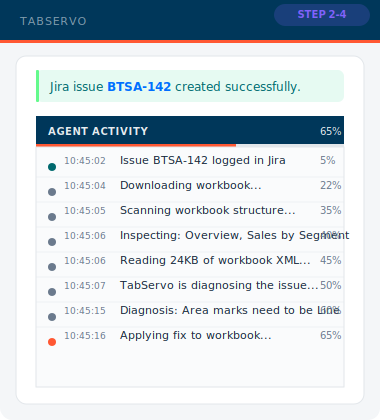
</p>

```
10:45:02  Issue BTSA-142 logged in Jira               5%
10:45:04  Interpreting issue...                        8%
10:45:05  Downloading workbook from Tableau Cloud...   22%
10:45:06  Scanning workbook structure...               35%
10:45:07  Inspecting: Overview, Sales by Segment       40%
10:45:07  Reading 24KB of workbook XML...              45%
10:45:07  TabServo is diagnosing the issue...          50%
10:45:18  Diagnosis: Area marks need to be Line        60%
10:45:18  Applying fix to workbook...                  65%
10:45:20  Publishing fixed workbook...                 90%
10:45:22  Fix published. Reload your dashboard.        100%
```

Meanwhile, the Jira ticket receives a detailed comment with everything that was changed:

<p align="center">
  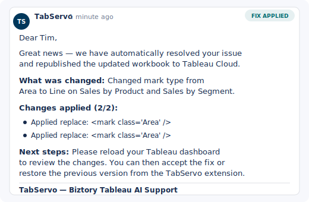
</p>

### 5. Review

After refreshing the dashboard, the user clicks **Accept** or **Decline**.

<p align="center">
  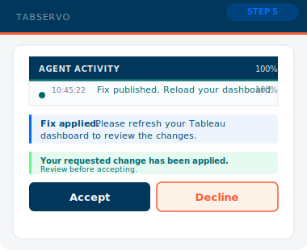
  &nbsp;&nbsp;&nbsp;
  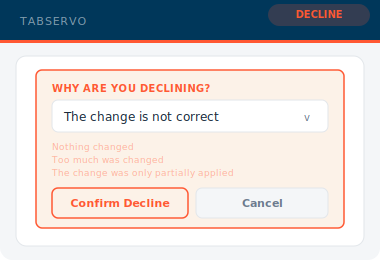
</p>

- **Accept**: Jira ticket is closed with a professional closing comment
- **Decline**: User selects a reason (nothing changed, too much changed, not correct, partially applied). The workbook is restored to its backup. Jira ticket moves to the backlog with the decline reason for human follow-up.

The Jira ticket is updated automatically based on the decision:

<p align="center">
  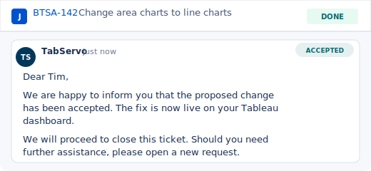
</p>

<p align="center">
  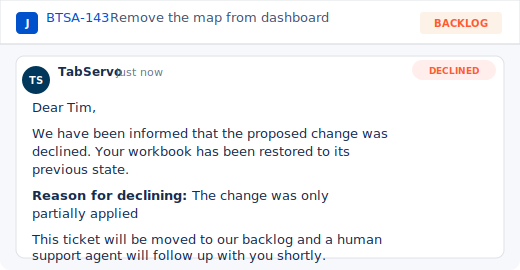
</p>

---

## Current Status

> **TabServo is heavily under development.** The current focus has been on building the end-to-end experience: seamless submission from inside Tableau, real-time progress tracking, professional Jira integration, one-click restore, and full auditability. The user experience is polished. The AI capabilities are intentionally starting small.

Today, TabServo reliably handles simple, well-defined changes. Think of it as a capable junior analyst that can follow clear instructions on straightforward tasks. Complex structural changes and multi-step operations are on the roadmap but not yet production-ready.

We chose this approach deliberately. A great experience with limited capabilities is more valuable than broad capabilities with a frustrating experience. The foundation is solid. Expanding what TabServo can do is now a matter of teaching, not rebuilding.

## What TabServo Can Fix Today

| Status | Request Types |
|--------|---------------|
| **Reliable** | Mark type changes (Bar, Line, Area), title text updates, formula edits, swap rows/columns, number formatting, tooltips |
| **Improving** | Filter changes, sorting, color encoding, remove/add sheets to dashboards, reference lines |
| **Experimental** | Create new worksheets, dashboard actions, calculated fields, dual-axis charts |

The agent understands the full Tableau TWB XML schema: worksheets, dashboards, zones, datasource-dependencies, column-instances, calculated fields, filters, actions, annotations, and more. The schema knowledge is in place. Translating that knowledge into reliable fix generation for every request type is the active area of development.

### Roadmap

Expanding capabilities is the primary focus going forward:

- **Higher success rates** on structural changes (zone removal, zone insertion)
- **Multi-step operations** (create a chart AND add it to the dashboard AND resize existing zones)
- **Cross-dashboard awareness** (changes that affect multiple dashboards)
- **Data source modifications** (calculated fields, parameters, groups, sets)
- **Learning from failures** (decline reasons feed back into prompt improvements)

---

## Architecture

```
User Layer       Tableau Dashboard  <-->  TabServo Extension (.trex)
                                              |
Application      TabServo Server (Node.js)  <-->  TabServo Agent
                  |        |                       |        |
AI Engine         |        |              Haiku   Opus   XSD Validator
                  |        |                       |
External         Jira    Tableau Cloud API    TabServo-log DS
```

**Frontend**: Tableau Extension with real-time Server-Sent Events for live progress tracking.

**Backend**: Node.js on Railway. REST API for submissions, progress streaming, and restore/accept/decline workflows.

**Agent**: Polls the server for triggers. Orchestrates the two-pass AI pipeline. Downloads, modifies, validates, and republishes workbooks.

**AI**: Claude Haiku for fast target identification. Claude Opus for deep XML analysis and fix generation.

**Validation**: XSD-based validation against the official Tableau 2026.1 schema. Smart XML matching with three-layer fallback.

**Integrations**: Jira Cloud (ADF-formatted tickets, automatic transitions), Tableau Cloud REST API (multi-site PAT authentication), TabServo-log published datasource (request tracking that persists across deploys).

---

## Multi-Site Support

TabServo supports multiple Tableau Cloud sites. Each site has its own Personal Access Token. The extension UI includes a site switcher dropdown. The agent authenticates per-request with fresh tokens.

```
# .env
Site=biztorypulse
TABLEAU_PAT_NAME=production-pat
TABLEAU_PAT_SECRET=...

TABLEAU_PAT_NAME_TIMDRIESDEV=dev-pat
TABLEAU_PAT_SECRET_TIMDRIESDEV=...
```

---

## Request Logging

Every request is tracked with:

| Field | Values |
|-------|--------|
| Issue ID | BTSA-142 |
| Summary | Change area charts to line charts |
| Category | bug, feature, access, question, performance, other |
| Timestamp | ISO 8601 |
| Fix Succeeded | Yes / No / Pending |
| Accepted | Accepted / Declined / Pending |
| Decline Reason | Nothing changed / Too much changed / Not correct / Partially applied |

Logs are:
- Published as a **TabServo-log** datasource to Tableau Cloud (survives deploys)
- Downloadable as **.xlsx** via `GET /api/log.xlsx`
- Available as **JSON** via `GET /api/log`

---

## Setup

### Prerequisites

- Node.js 18+
- Tableau Cloud site with Site Administrator Creator role
- Personal Access Token (PAT) for each Tableau Cloud site
- Jira Cloud project with API token
- Anthropic API key

### Installation

```bash
git clone https://github.com/tdries/Tableau-Self-Service-Support.git
cd Tableau-Self-Service-Support
npm install
```

### Configuration

Create a `.env` file:

```env
# Shared
ANTHROPIC_API_KEY=sk-ant-...
JIRA_EMAIL=you@company.com
TAB_SUPPORT_AI_FULL=your-jira-api-token
Tableau_URL=https://10ax.online.tableau.com/
RAILWAY_URL=https://your-app.up.railway.app

# Tableau site credentials
Site=your-site
TABLEAU_PAT_NAME=your-pat-name
TABLEAU_PAT_SECRET=your-pat-secret
```

### Running

```bash
# Start both server and agent
npm start        # Server on port 8766
npm run agent    # Agent polls server for triggers
```

### Adding to Tableau

1. Open a dashboard in Tableau Desktop or Tableau Cloud (Edit mode)
2. Drag an **Extension** object onto the dashboard
3. Select `manifest.trex` from the project folder
4. The TabServo form appears inside the dashboard

---

## API Endpoints

| Method | Path | Description |
|--------|------|-------------|
| `POST` | `/api/submit-issue` | Submit a new support request |
| `GET` | `/api/progress/:id` | SSE stream for real-time progress |
| `GET` | `/api/progress-check/:id` | Polling fallback for progress |
| `POST` | `/api/resolve` | Accept or decline a fix (posts to Jira) |
| `POST` | `/api/restore` | Queue a workbook restore |
| `GET` | `/api/log` | Full request log (JSON) |
| `GET` | `/api/log.xlsx` | Download request log as Excel |
| `PATCH` | `/api/log/:id` | Update log entry |

---

## Why TabServo

**For business users**: Submit issues without leaving Tableau. Watch the fix happen in real time. Accept or restore with one click. No waiting for IT.

**For IT teams**: Every issue logged in Jira with full context. Automatic fix attempts before escalation. Full audit trail of what changed and when. Only unresolvable issues reach the support queue.

**For Tableau developers**: No more interrupt-driven fix requests. Only complex issues that TabServo cannot solve reach the team. All changes tracked with analysis comments.

**For the organisation**: Level 1 Tableau support automated. Analyst hours freed for high-value work. Response time reduced from days to minutes. Complete auditability across every request.

---

## Built With

- [Tableau Extensions API](https://tableau.github.io/extensions-api/) for embedding inside dashboards
- [Claude AI](https://anthropic.com) (Haiku + Opus) for workbook analysis and fix generation
- [Tableau REST API](https://help.tableau.com/current/api/rest_api/en-us/REST/rest_api.htm) for workbook download/publish
- [Jira REST API](https://developer.atlassian.com/cloud/jira/platform/rest/v3/) for ticket management
- Node.js + Server-Sent Events for real-time progress
- Tableau 2026.1 XSD schema for validation

---

*Built by [Biztory](https://biztory.com) as part of the Tableau AI Support initiative.*
